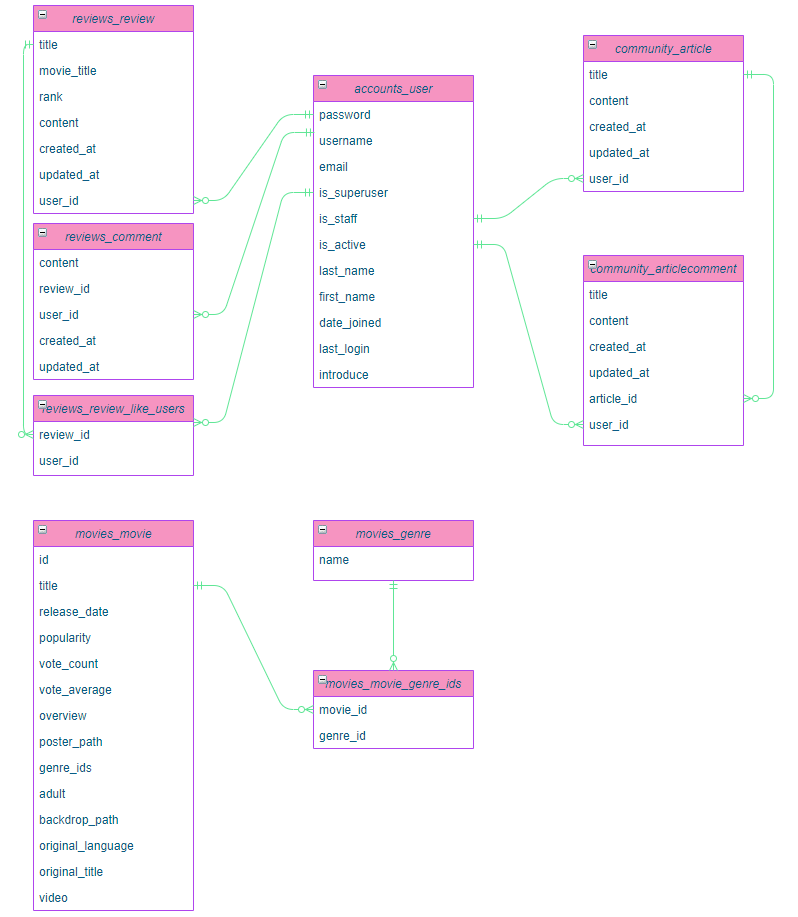
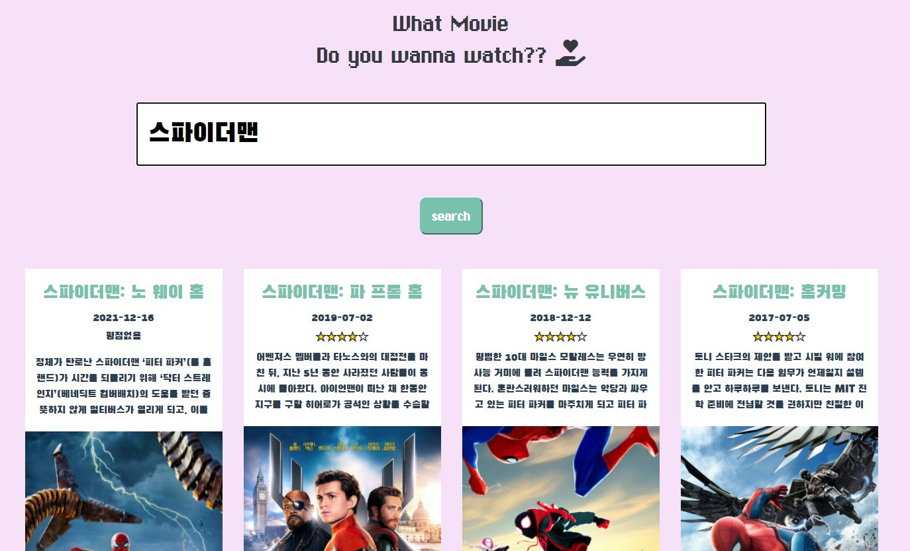
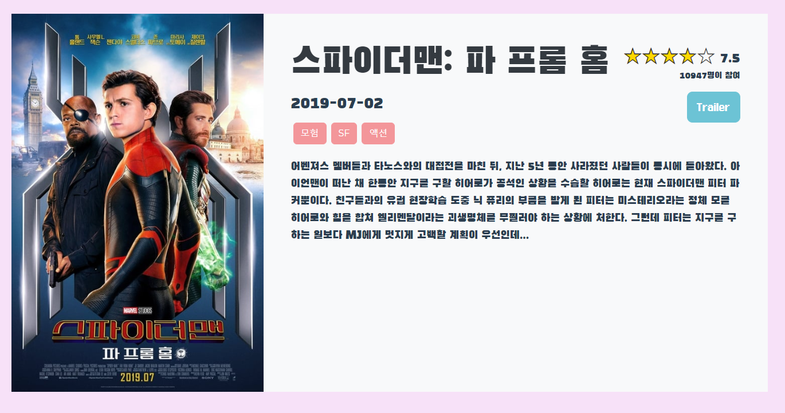
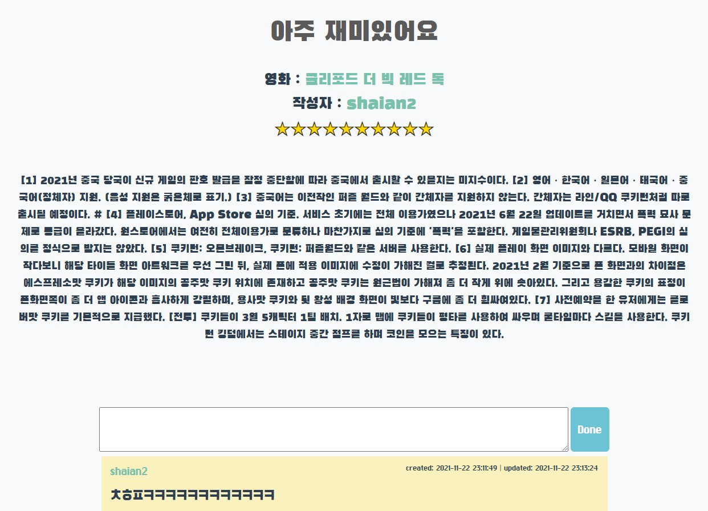

# Final project

#### : 영화 리뷰&추천 사이트


### 1) 팀원 및 업무 분담 내역

| 담당자 | 사용언어 / 툴                                                | 담당 업무                                                    |
| ------ | ------------------------------------------------------------ | ------------------------------------------------------------ |
| 정명수 | Python<br />Django<br />Vue.js<br />HTML / CSS<br />JavaScript<br />Bootstrap<br />c9 | 팀장<br />Database construction<br />Recommendation algorithm<br />UX/UI design<br />API management<br />Website Distribution |


### 2) 목표 서비스 및 실제 구현 정도

| 페이지명        | 목표                                                         | 실제 구현                                                    |
| --------------- | ------------------------------------------------------------ | ------------------------------------------------------------ |
| base            | 반응형 Navbar<br />footer 구현<br />favicon 적용             | 반응형 Navbar<br />footer 구현                               |
| Home            | 최신 영화 이미지를 넘기는 carousel <br />영화 검색 기능<br />검색된 영화들을 반응형 카드 형태로 보여줌<br />위 기능 이용 권한을 로그인 사용자에게만 부여 | 최신 영화 이미지를 넘기는 carousel <br />영화 검색 기능<br />검색된 영화들을 반응형 카드 형태로 보여줌<br />위 기능 이용 권한을 로그인 사용자에게만 부여 |
| Signup          | 아이디, 비밀번호, 비밀번호 확인, 이메일, 성, 이름 입력 폼 구현<br />유효성 검사 미통과시 alert 창으로 알림, 가입 불가능 | 아이디, 비밀번호, 비밀번호 확인, 이메일, 성, 이름 입력 폼 구현<br />유효성 검사 미통과시 alert 창으로 알림, 가입 불가능 |
| Login           | 아이디, 비밀번호 입력 폼 구현<br />유효성 검사 미통과시 alert 창으로 알림, 로그인 불가능<br />소셜 로그인 구현 | 아이디, 비밀번호 입력 폼 구현<br />유효성 검사 미통과시 alert 창으로 알림, 로그인 불가능 |
| User profile    | 유저 정보 출력<br />유저 프로필 사진 등록 기능<br />정보는 본인만 수정 가능<br />소개글 등록 및 수정<br />최근 시청한 영화 및 작성한 리뷰 목록<br />추천 영화 등록 기능 | 유저 정보 출력<br />정보는 본인만 수정 가능<br />소개글 등록 및 수정<br />작성한 리뷰 및 댓글 목록<br />리뷰와 댓글명 클릭하면 이동 |
| Movie Recommend | 유저가 등록한 리뷰의 평점이 7점 이상인 영화들의 장르를 뽑아 가장 많은 수의 장르를 선택함. 그 장르 영화 중 별점이 높은 순으로 6개 추천<br />추천할 영화들을 카드 형태로 보여줌<br />카드 제목을 클릭하면 영화 상세 페이지로 이동<br />평점 7점 이상의 리뷰가 없을 시 추천되지 않음 | 유저가 등록한 리뷰의 평점이 7점 이상인 영화들의 장르를 뽑아 가장 많은 수의 장르를 선택함. 그 장르 영화 중 별점이 높은 순으로 6개 추천<br />추천할 영화들을 카드 형태로 보여줌<br />카드 제목을 클릭하면 영화 상세 페이지로 이동<br />평점 7점 이상의 리뷰가 없을 시 추천되지 않음 |
| Movie detail    | 영화 상세 정보 출력<br />사용자 추천 영화에 추가 및 제거 기능<br />최근 등록된 영화 리뷰 출력<br />리뷰 제목 클릭하면 리뷰 상세 페이지로 이동 | 영화 상세 정보 출력<br />사용자 추천 영화에 추가 및 제거 기능<br />최근 등록된 영화 리뷰 출력<br />리뷰 제목 클릭하면 리뷰 상세 페이지로 이동<br />트레일러 영상 재생 가능 |
| Review list     | 작성된 리뷰를 최신순으로 출력<br />좋아요를 많이 받은 글 5위까지 출력<br />리뷰 작성 버튼 | 작성된 리뷰를 최신순으로 출력<br />리뷰 작성 버튼<br />한 페이지에 리뷰 10개까지 출력되도록 Pagination 적용 |
| Review detail   | 리뷰 상세 정보 출력<br />좋아요 버튼<br />댓글 작성 기능<br />리뷰와 댓글 모두 작성자만 수정, 삭제 가능<br />작성자 아이디 클릭하면 프로필 페이지로 이동<br />영화 제목 클릭하면 영화 상세 페이지로 이동 | 리뷰 상세 정보 출력<br />댓글 작성 기능<br />리뷰와 댓글 모두 작성자만 수정, 삭제 가능<br />작성자 아이디 클릭하면 프로필 페이지로 이동<br />영화 제목 클릭하면 영화 상세 페이지로 이동 |
| Review Create   | 제목, 영화 이름, 평점, 내용 작성 폼 구현                     | 제목, 영화 이름, 평점, 내용 작성 폼 구현<br />영화 이름 input에서 영화를 골라 선택할 수 있도록 datalist 태그 사용 |
| Community       | -                                                            | 자유롭게 소통할 수 있는 게시판<br />Review와 동일하게 구현   |


### 3) 데이터베이스 모델링(ERD)




### 4) 필수 기능에 대한 설명

#### 영화 검색



- Home 화면에 구현된 검색기능. 검색하면 영화들이 정렬되어 출력된다.


#### 영화 상세



- 평점에 따라 별이 채워지도록 했다.
- trailer 정보가 있으면 바로 밑에 trailer 영상이 뜬다.


- 출연 배우 목록을 출력한다.


#### 영화 추천


- 유저가 등록한 리뷰의 평점이 7점 이상인 영화들의 장르를 뽑아 가장 많은 수의 장르를 선택함. 그 장르 영화 중 별점이 높은 순으로 6개 추천
- 추천할 영화들을 카드 형태로 보여줌
- 카드 제목을 클릭하면 영화 상세 페이지로 이동
- 평점 7점 이상의 리뷰가 없을 시 추천되지 않음


#### 리뷰 상세



- 리뷰와 댓글 모두 작성자만 수정, 삭제 가능
- 작성자 아이디 클릭하면 프로필 페이지로 이동
- 영화 제목 클릭하면 영화 상세 페이지로 이동


#### 유저 프로필


- 정보는 본인만 수정 가능
- 소개글 등록 및 수정
- 리뷰와 댓글명 클릭하면 상세 페이지로 이동


### 5) 배포 서버 URL

```
https://frosty-varahamihira-a0c1ce.netlify.app/
```


### 6) 느낀점

 처음 DB에 영화를 가져오는 방식부터 어떻게 해야할 지 방향을 잡지 못했습니다. 배운거라곤 .json파일을 loaddata로 가져오는 방식 밖에 아는 것이 없었고, 그것을 활용하기 위해서는 배웠던 requests와 python, django를 모두 활용해야 했습니다. 

겨우 고비를 넘긴 다음, 진행해야 하는 vue는 더 큰 난항이었습니다. Django만을 활용하면 아주 쉽게 구현이 되고, CSS/bootstrap으로 꾸며주기만 하면 되는 문제였지만, Vue가 합쳐지는 순간부터는 Vue를 통해 Django에 데이터를 보내 반응을 보내줘야했습니다. 파일이나 다른 데이터들이 사실 자세히 어떻게 전달이 되는지도 완전히 이해하지 못했었고, vue와 javascript 역시 일주일 만에 배웠기에 도저히 손대기 어려운 부분들이 많아, 모든 과정 하나하나에 디버깅을 위해 터미널과 콘솔에 출력해가며 한 발짝씩 만들어갔습니다. 그나마 페어로 진행했기에 더 지체될 수 있었던 부분이 빠르게 해결되어 다행이라 생각했습니다. 하나의 연결이 이어지고 나서부터는 원리를 깨닫고 속도가 붙어 거의 3일 정도만에 모든 기능을 구현해 낼 수 있었습니다. 아마 지금부터 이와 같은 사이트를 만드는 과제가 주어진다면, 하루이틀 정도면 충분할 것 같다는 생각이 들었고 그만큼 부족했다는 것도 느낄 수 있었습니다.  

모든 언어나 프로젝트 구현이 이와 같지 않을까 생각합니다. 프로젝트를 통해 Vue나 배포를 하는 것을 체험해 볼 수 있었고, 배포에 대해서 더 배우고 싶었습니다. 구현하지 못한 프로필 사진부분이나 소셜 로그인도 따로 공부해보고 싶습니다.


#### 7) 기타

- ERD 그리기

  ```
  https://app.diagrams.net/
  ```

- UI / UX 프로토타이핑

  ```
  https://ovenapp.io/
  ```

- 부트스트랩 테마

  ```
  https://bootswatch.com/minty/
  ```

- TMDB API로 영화 json 파일 받음

- 백 (Django) 배포

  - 미국 동부 (오하이오) `us-east-2` 에서 배포함
  -  Cloud9, EC2, Route 53 사용
  - nmovie.de 도메인 네임 구매하여 사용
  - https 적용

  ```
  https://app.netlify.com/
  ```

- 프론트(Vue) 배포

  ```
  https://app.netlify.com/
  ```

- favicon 제작 사이트

  ```
  https://www.favicon.cc/
  ```

- 도트 이미지 제작 사이트

  ```
  https://www.piskelapp.com/p/create/sprite
  ```

- 폰트 다운로드 사이트

  ```
  https://fontmeme.com/ktype/euxoi-font/
  ```

  
